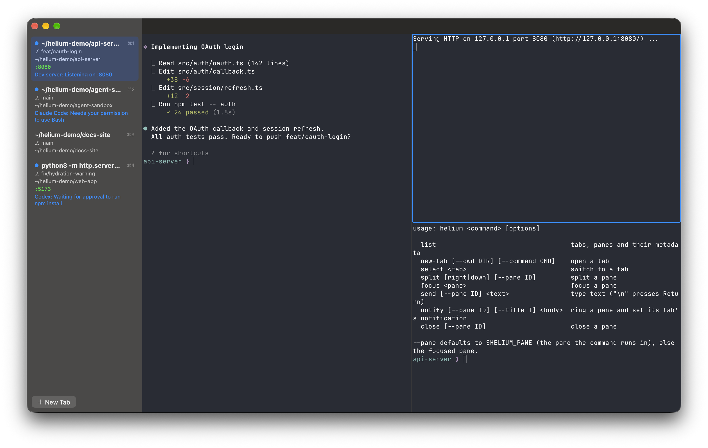

<p align="center">
  
</p>

<h1 align="center">Helium Terminal</h1>

<p align="center">A small macOS terminal for running coding agents, built on libghostty. It's native Swift and AppKit, with no Electron.</p>

- A sidebar of vertical tabs showing the title, git branch, cwd, listening ports and the latest notification
- A blue ring on a pane, and a dot on its tab, when the pane needs attention
- Horizontal and vertical splits inside each tab
- A Unix socket API, plus the `helium` command-line tool
- Rendering by libghostty (Metal), configured by your existing Ghostty config (`~/.config/ghostty/config`)



## Install

Apple Silicon, macOS 13 or later.

```sh
brew install --cask yowmamasita/tap/helium-terminal   # Homebrew: installs to /Applications
zb install yowmamasita/tap/helium-terminal            # zerobrew
```

Both also install the `helium` command. Run `helium` with no arguments to open the app.

## Build from source

Needs Xcode and Zig 0.16.0.

```sh
scripts/build-ghostty.sh   # libghostty -> vendor/ghostty/macos/GhosttyKit.xcframework
scripts/build-app.sh       # -> "build/Helium Terminal.app"
```

To release, bump `VERSION`, add `packaging/notes/<version>.md`, and run `NOTARY_PROFILE=<profile> scripts/release.sh`.
That script builds, signs, notarizes, publishes the GitHub release and updates the tap.

## Settings

⌘, opens Settings. The Terminal tab covers the common Ghostty options (font, theme, cursor, opacity, padding,
scrollback, Option as Alt, copy on select). Changes apply to open terminals right away and are saved to
`~/Library/Application Support/helium-terminal/config`, which loads after your Ghostty config, so Helium never
rewrites a config you share with Ghostty.app. The All Options tab lists every Ghostty option with its current
value and documentation; `helium +show-config --docs` prints the same from the command line.

## Updates

The app checks GitHub for a new release shortly after launch and then daily. It downloads the new version and
installs it only if it's signed by the same Apple developer and notarized. It replaces itself on disk without
interrupting your terminals, and the sidebar then shows a Relaunch button. Turn this off, or check now, in Settings.
Copies installed with zerobrew (or as a Homebrew formula) and development builds don't update themselves.

## Keys

Keys come from Ghostty's default keybinds (or your own Ghostty config): cmd+t new tab, cmd+d split right,
cmd+shift+d split down, cmd+w close, cmd+1..9 switch tab, cmd+[ / cmd+] previous/next split,
cmd+opt+arrows move between splits.

## Notifications

A pane rings when a program sends a desktop notification (OSC 9 or OSC 777), rings the bell, or runs
`helium notify`. The ring clears when you focus the pane. For Claude Code, add a hook:

```json
{ "hooks": { "Notification": [{ "hooks": [{ "type": "command", "command": "helium notify --title Claude \"needs input\"" }] }] } }
```

## CLI / socket API

```
helium list                                  tabs, panes and their metadata (JSON)
helium new-tab [--cwd DIR] [--command CMD]
helium select <tab>     helium focus <pane>
helium split [right|down] [--pane ID]
helium send [--pane ID] "make test\n"
helium notify [--pane ID] [--title T] <body>
helium close [--pane ID]
```

`--pane` defaults to `$HELIUM_PANE`, which is set in every pane. The socket is
`~/Library/Application Support/helium-terminal/helium.sock` (mode 0600). It takes one JSON object per line,
e.g. `{"cmd":"notify","pane":"3","arg":"done"}`.

## Performance (vs cmux 0.65.0, Apple Silicon, `bench/final.sh`)

| | Helium | cmux |
|---|---|---|
| App size | 12 MB | 745 MB |
| Launch until the window appears | ~290 ms | ~1,080 ms |
| Memory, focused window | 152 MB | 323 MB |
| Memory, background window | 58 MB | 319 MB |
| Idle CPU, focused (cursor blinking) | 0.5% | 3.3% |
| Idle CPU, background | 0.1% | 3.1% |

Output speed is the same, because both use libghostty: 50 MB of plain text takes 0.16 s, and 50 MB of
color-heavy output takes 0.43 s.

How it stays light:
- libghostty is built ReleaseFast without Sentry or translations, and patched for double buffering
  (`patches/`), so each visible pane holds one fewer full-window GPU surface.
- A surface counts as focused only in the key window, so a background window stops blinking and redrawing.
- Hidden tabs and covered or minimized windows stop rendering, and libghostty frees their GPU buffers.
- Metadata (branch, ports, cwd) comes from file reads and libproc every 3 s, with no subprocesses.

## Not included

Bundled Ghostty themes (put any you use in `~/.config/ghostty/themes`), session restore, a browser pane, system notification banners, images on the clipboard, and
an Intel build.

## Credits

Keyboard, IME and mouse handling is adapted from Ghostty's macOS app (MIT, Mitchell Hashimoto and Ghostty contributors).
